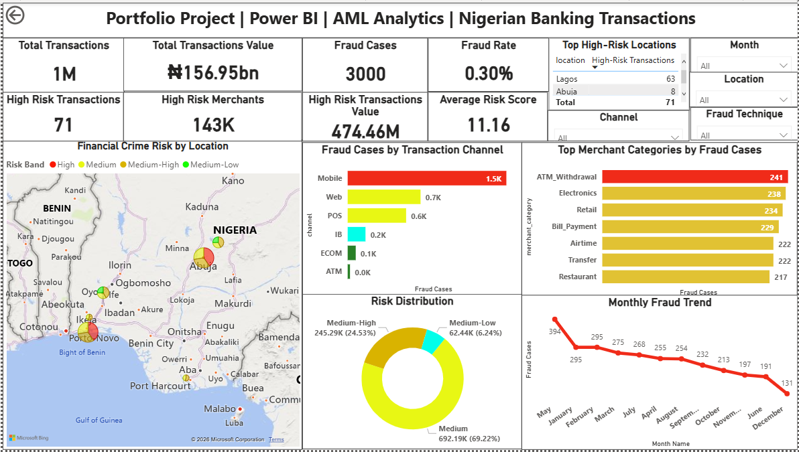
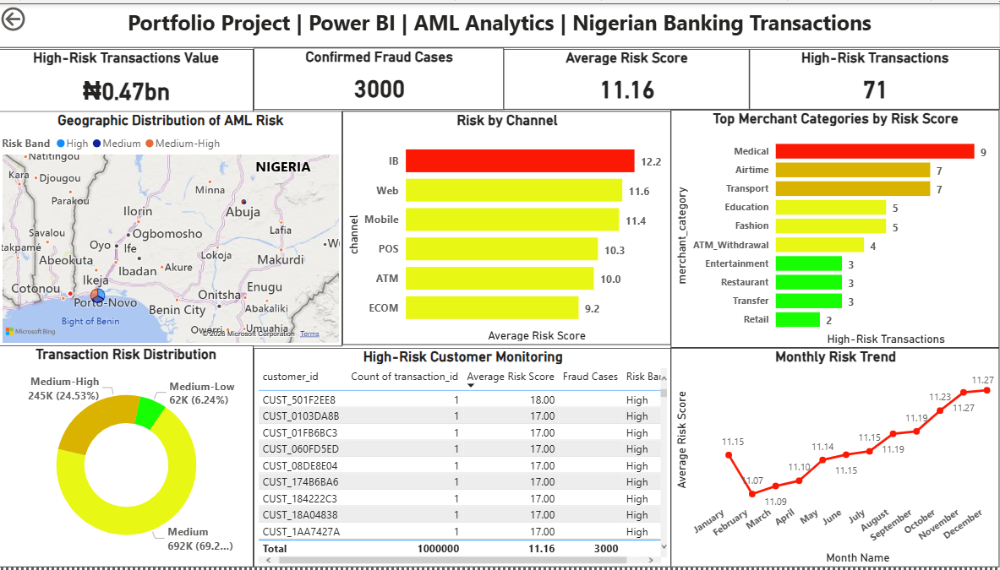
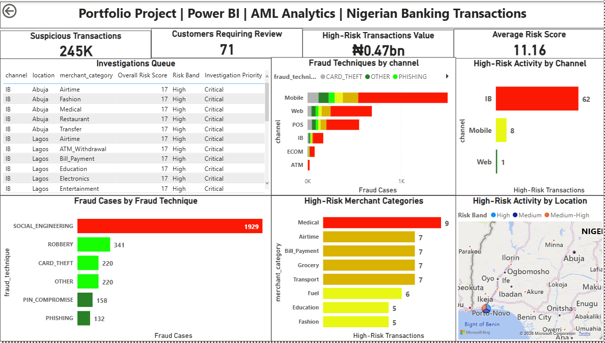

  **Nigeria Financial Crime Intelligence & AML Risk Monitoring Platform**
Interactive Power BI dashboards built for fraud detection, AML risk monitoring, and investigation prioritization using the NIBSS Fraud Dataset
________________________________________
**Overview**
This project shows how data analytics and visualization can strengthen fraud detection, AML risk monitoring, and investigation prioritization within the Nigerian payments ecosystem. Using the publicly available NIBSS Fraud Dataset, an end to end Financial Crime Intelligence & AML Monitoring Platform was built in Power BI to highlight fraud trends, risk concentration across NIP/POS/USSD channels, customer exposure, and high risk transactional activity.
________________________________________
**Tools Used**
•	Power BI
•	Power Query
•	DAX
•	Star Schema Data Modelling
________________________________________
**Dataset**
•	Source: Kaggle – NIBSS Fraud Dataset
•	Approximately one million transaction records
•	Country: Nigeria
________________________________________
  **Dashboard Screenshots**

## Nigeria Financial Crime Dashboard

---

## Nigeria AML Risk Monitoring Dashboard

---

## Nigeria Crime Investigation Dashboard

________________________________________

**Key Findings**
•	Fraud activity concentrated in specific channels — Most confirmed cases were linked to a small set of high risk NIBSS channels and merchant categories.
•	Risk uneven across locations — Certain states showed disproportionately higher exposure compared to the rest of the country.
•	Only a small share required urgent review — A limited portion of total transactions triggered high risk flags or required immediate analyst attention.
•	High risk behaviour concentrated among few customers — Suspicious activity was not widespread but clustered around a small group of customers.
•	Social engineering dominated confirmed fraud — Techniques such as impersonation, phishing, and account takeover accounted for most verified fraud incidents.
________________________________________

**Recommendations**
•	Strengthen monitoring of high risk transactions — Prioritise unusual or high value activity, especially across NIP, POS, and USSD channels.
•	Tighten controls around higher risk channels and MCCs — Apply additional checks and preventive rules for channels and merchant categories with elevated fraud exposure.
•	Adopt risk based investigation workflows — Focus analyst effort on customers, merchants, and locations with the highest risk signals.
•	Review and recalibrate risk scoring models — Continuously adjust scoring thresholds to reflect emerging fraud patterns and behavioral shifts.
•	Leverage analytics to enhance fraud and AML monitoring — Expand the use of dashboards, trend analysis, and behavioural insights to improve detection and decision making.
________________________________________

**Future Enhancements**
Potential improvements to the platform include:
•	Integrating customer risk ratings and CDD/KYC information to strengthen customer level profiling.
•	Adding sanctions and PEP screening data to support compliance checks and escalation decisions.
•	Introducing network analysis to uncover linked accounts, related entities, and suspicious relationships.
•	Applying machine learning models for anomaly detection and predictive fraud scoring.
•	Including cross border transaction insights and jurisdictional risk indicators for broader AML coverage.
•	Implementing dynamic risk scoring that adjusts to evolving patterns and customer behavior.
•	Building real time monitoring and alerting to support faster detection and response.
________________________________________

**Documentation**
A full report covering the business problem, objectives, dataset details, data model, risk scoring approach, key findings, recommendations, limitations, and conclusions is included in the project’s documentation folder.
________________________________________

**Disclaimer**
This project contains no confidential customer, institutional, or regulatory information. All work was created solely for educational and portfolio purposes using publicly available data

